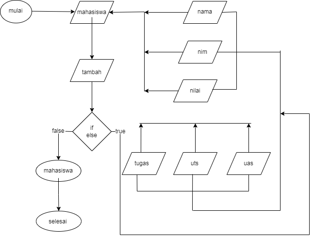

# **PROGRAM SEDERHANA UNTUK MENAMBAHKAN DATA KEDALAM SEBUAH LIST**

PENJELASAN

1. deklasi list mashasiswa untuk menampung  nama, nimm, nilai 
2. deklarsi nomor untuk mennteukan data bebrapa
3. menggunkan pengulangan while 
4. deklari nilao_tugas, nilai_uts, nilai_uas
5. masukan nilai_tugas (list0)
6. massukan nilai_uts(list1)
7. masukan nilai_uas (list2)
8. jumlahkan da bagi 3
9. deklari variabel tambah
10. gunakan if verfy yang di isi string "y"
11.ketik user untuk menginput string "n"
12.di dalam statment else gunakan for data di dalam data mahasiswa untuk melooping data.

